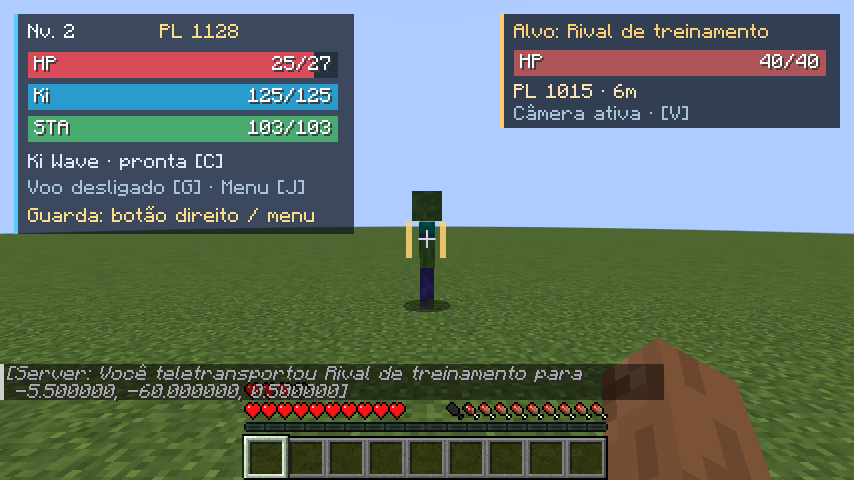
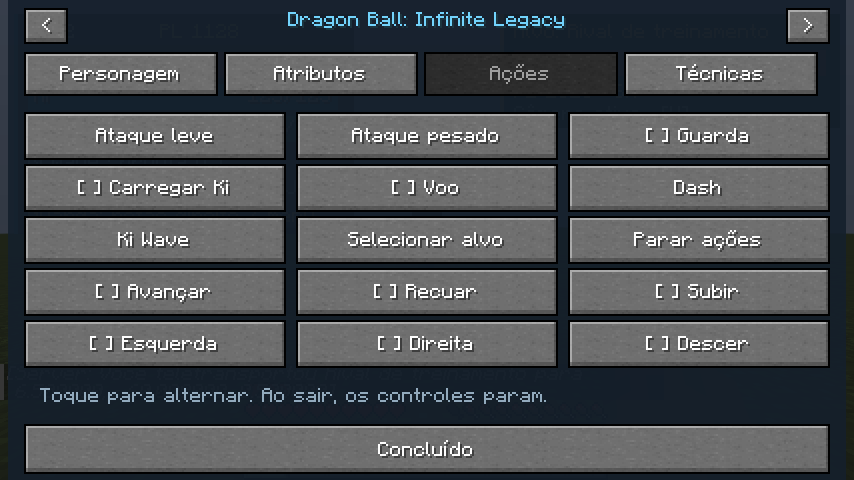
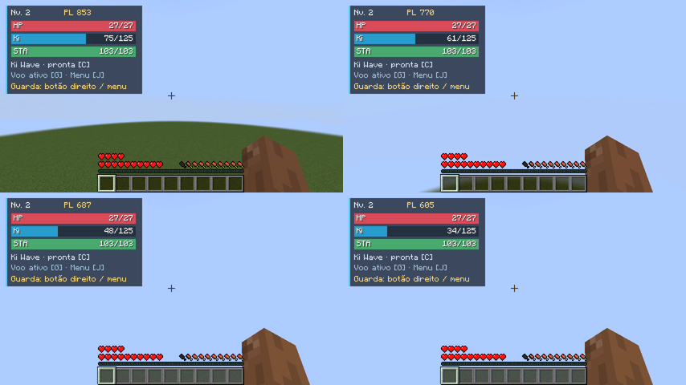
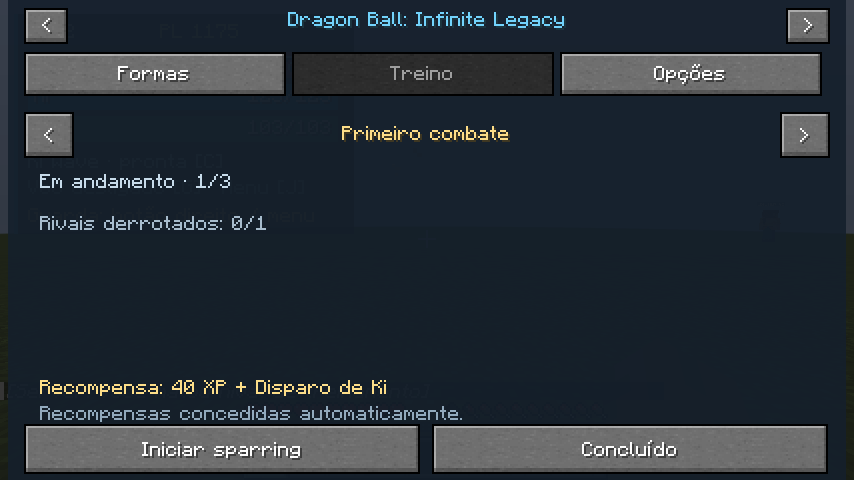

# Validação gráfica da versão 0.2

## Preparação e origem dos personagens

O teste reutiliza o mundo dedicado e os dois personagens salvos pela versão 0.1. Mundo e player data foram copiados antes da atualização para `/workspace/.tools/client-runtime/v02/`, sem recriar personagens.

Dados de origem (NBT schema 2):

| Jogador | Personagem | Raça/origem/estilo | Nível / XP | Ki / Stamina máximos |
|---|---|---|---|---|
| DBILTestOne | Kairo Earth | Humano / Guerreiro da Terra / Equilibrado | 2 / 70 | 125 / 103 |
| DBILTestTwo | Raku Survivor | Saiyajin / Sobrevivente / Lutador | 1 / 35 | 120 / 100 |

Ambos tinham Ki Wave desbloqueada/equipada e nenhuma transformação desbloqueada. Os valores completos de origem estão em `baseline-one.json` e `baseline-two.json` nas ferramentas da sessão. Esses valores são baseline histórico, não uma certificação da persistência final da 0.2.

Os clientes foram preparados com `camera=false` antigo e sem `lockOnCamera`, permitindo validar a migração para o novo padrão sem habilitar manualmente a câmera.

Ambiente: cliente Minecraft real, Java 17/Forge 47.3.22, Xvfb, OpenGL 4.5 Mesa llvmpipe, janela 854×480, GUI 2, limite de 30 FPS, distância de renderização 3 e simulação 5. O servidor é um processo dedicado separado. Isso não representa Android físico, Battly, autenticação online ou benchmark de um PC modesto.

## Build e identificação do artefato

Regressão final: `./gradlew build runGameTestServer`, **BUILD SUCCESSFUL em 2m 3s**. Às 14:12:33 UTC de 2026-10-04, o log `/tmp/dbil-v02-final-build-tests.log` registrou **All 50 required tests passed**, incluindo cinco testes de guarda e os dois testes adicionais de poder.

Artefato final: `build/libs/dbil-0.2.0.jar`.

SHA-256: `421e7f6b7868678804ff26eada06cc968f07d1e661578fef12b0e5840009e802`.

A execução gráfica de movimento/interface abaixo começou no JAR anterior da mesma versão, identificado no roteiro por prefixo de hash `2af..`. A revisão final alterou o cálculo de Poder de Luta/testes correspondentes; movimento e interface permaneceram iguais. Não atribuir capturas anteriores à execução do JAR final sem registrar essa origem.

## Resultados gráficos confirmados

### Câmera e interface

- Lock-on seguiu o alvo com o novo padrão ativado, partindo de configuração antiga `camera=false`, sem editar manualmente a opção nova.
- Alvo à esquerda: rotação real observada mudou de 0° para **+89,999985°**.
- Com a aba Ações aberta, alvo à direita: rotação mudou para **−89,99999°**; os botões de toque não suspenderam o acompanhamento.
- Telas Ações e Treino foram renderizadas; o cartão de alvo apresenta HP, distância e metadata de Poder de Luta. Os screenshots documentam a disposição real, sem simulação da interface.

### Voo contínuo

Voo mantido por **31 segundos**, combinando W, Espaço e Shift, com frenagem. A sequência de inputs observada avançou de **656 para 865**, sem correção forte registrada (**hard corrections = 0**) durante esse trecho. O consumo de Ki e diferentes alturas aparecem na composição de capturas abaixo. Esse teste comprova o trecho local observado, não ausência de correções em qualquer rede.

Vídeo bruto da sessão: [flight-root-35s.mp4](/workspace/.tools/client-runtime/v02/flight-root-35s.mp4). O nome/duração total do vídeo inclui a preparação; os 31 segundos referem-se ao intervalo de voo acompanhado pelo teste.

### Sparring e guarda

- Um jogador sem OP iniciou sparring pelo menu Treino.
- O rival criado perseguiu e atacou o jogador; o loop não dependeu de `/dbil spawn`.
- Guarda ativa foi observada como `guarding=true`; Stamina observada em **13** durante o teste.
- Isso confirma ativação/estado e uso de reserva. A redução de dano não foi comparada manualmente em dois impactos equivalentes nesta revisão; sua validação funcional automatizada está nos cinco GameTests de guarda aprovados.

## Verificações ainda em andamento

O implementador principal está concluindo seleção/uso das novas técnicas, formas/cabelo/auras e persistência após reinício, além das verificações cooperativas correspondentes. Atualizar esta seção somente com resultados efetivamente observados. Não tomar testes administrativos que liberem técnica/forma como evidência de cumprimento natural dos desafios.

## Limites da evidência

Android físico/Battly e redes com latência real não foram testados. Limite configurado de 30 FPS não é uma medição de FPS sustentado. Software GL e hardware cloud não permitem afirmar desempenho, memória ou fluidez em um aparelho específico. Avisos de ambiente e eventuais problemas observados devem acompanhar o relatório final, separados dos resultados de GameTests.

## Fechamento

A entrega foi antecipada a pedido do usuário. O resultado definitivo e os limites dos testes estão em SESSION_REPORT_02.md. Dois clientes conectaram; voo, câmera, sparring e recompensa do primeiro desafio foram exercitados. Verificações visuais completas das técnicas novas e formas ficaram pendentes. Android/Battly físico não foi testado.
